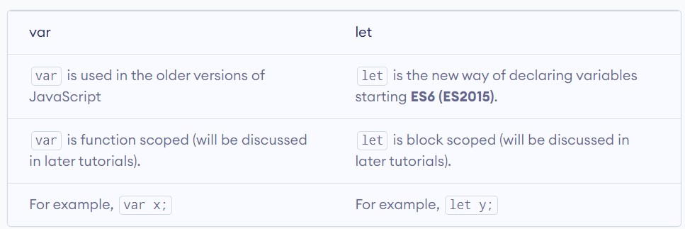
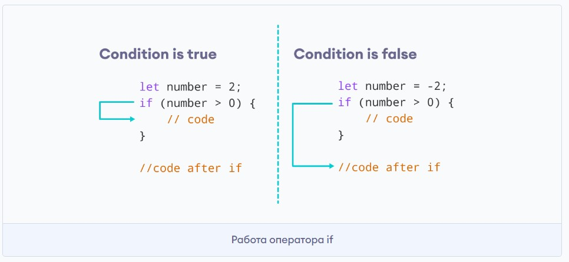
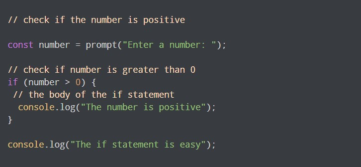
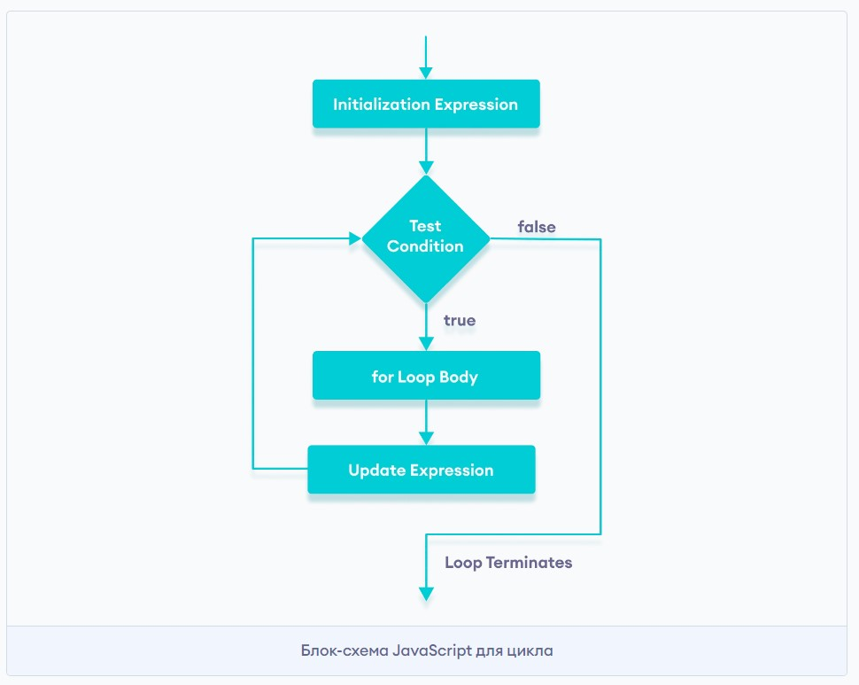
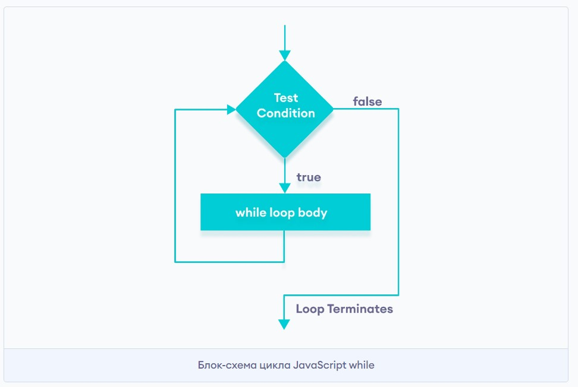
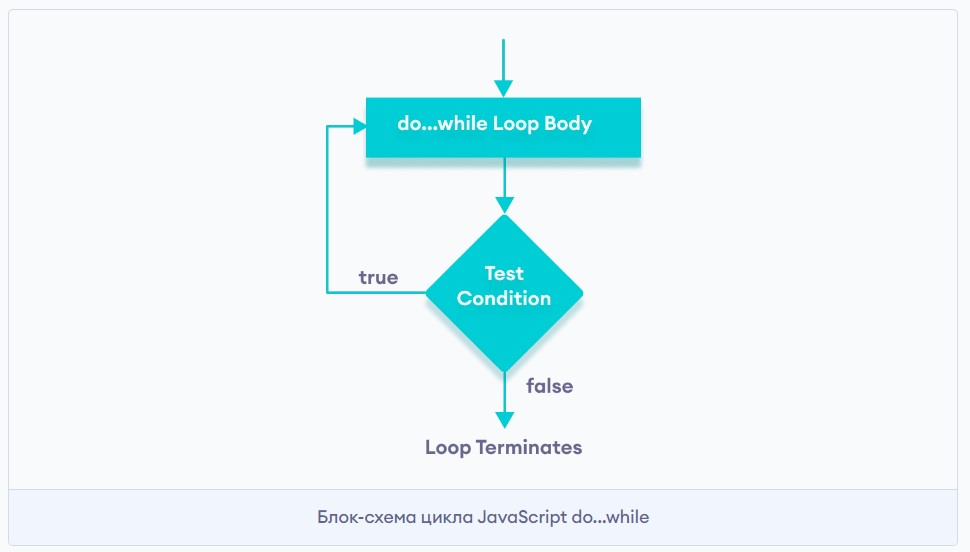
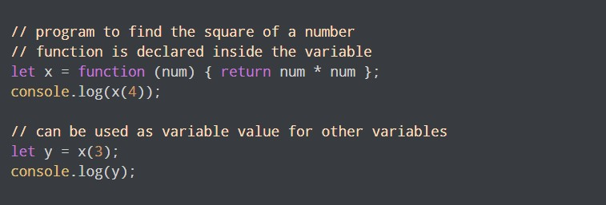

# JavaScript
### JavaScript — популярный язык программирования, который имеет широкий спектр приложений.

### Раньше JavaScript использовался в основном для создания интерактивных веб-страниц, таких как проверка форм, анимация и т. д. В настоящее время JavaScript также используется во многих других областях, таких как разработка на стороне сервера, разработка мобильных приложений и т. д.
#
# JavaScript Variables and Constants

## JavaScript Variables
### В программировании переменная — это контейнер (область хранения) для хранения данных. Например,
## let num = 5;
### Здесь numпеременная. Он хранит 5

## JavaScript Declare Variables
### В JavaScript мы используем ключевое слово varили letдля объявления переменных. Например,
## var x;
## let y;
### Здесь,x и у являются переменными.
## JavaScript var Vs let
### Оба varи letиспользуются для объявления переменных. Однако между ними есть некоторые различия.

## JavaScript Constants
### Ключевое constслово также было введено в версии ES6 (ES2015) для создания констант. Например,
### const x = 5;

### После инициализации константы мы не можем изменить ее значение.

### const x = 5;
### x = 10;  // Error! constant cannot be changed.
### console.log(x)
### Проще говоря, константа — это тип переменной, значение которой нельзя изменить.
### Кроме того, вы не можете объявить константу без ее инициализации. Например
### const x;  // Error! Missing initializer in const declaration.
### x = 5;
### console.log(x)
#
# JavaScript Data Types
### Существуют различные типы данных, которые мы можем использовать в программе JavaScript. Например,
### const x = 5;
### const y = "Hello";

### Здесь,

### 5 представляет собой целочисленные данные.
### "Hello"это строковые данные.
## JavaScript Data Types
### В JavaScript существует восемь основных типов данных. Они есть:

### Здесь все типы данных, кроме Objectпримитивных типов данных, а Objectне примитивные.
#
# JavaScript Operators

## Что такое оператор?
### В JavaScript оператор — это специальный символ, используемый для выполнения операций над операндами (значениями и переменными). Например,
### 2 + 3; // 5

## Типы операторов JavaScript
### Вот список различных операторов, которые вы изучите в этом руководстве.

### * Операторы присваивания
### * Арифметические операторы
### * Операторы сравнения
### * огические операторы
### * Побитовые операторы
### * Строковые операторы
### * Другие операторы
#
# JavaScript if...else Statement
### В компьютерном программировании могут возникнуть ситуации, когда вам нужно запустить блок кода среди нескольких альтернатив. Например, выставление оценок A , B или C на основе оценок, полученных учащимся.

 ### В таких ситуациях вы можете использовать оператор JavaScript if...elseдля создания программы, которая может принимать решения.
### В JavaScript есть три формы оператора if...else.
### if оператор
### оператор if...else
### if...else if...else утверждение

## Пример

## Выход

## Оператор JavaScript if...else

### Оператор ifможет иметь необязательный elseпункт. Синтаксис оператора if...else:

### Оператор if..elseоценивает условие внутри круглых скобок.

### Если условие оценивается как true,

### 1. код внутри тела ifвыполняется
### 2. код внутри тела elseпропускается при выполнении

### Если условие оценивается как false,

### 1. код внутри тела elseвыполняется
### 2. код внутри тела ifпропускается при выполнении

## JavaScript if...else if statement
### Оператор if...elseиспользуется для выполнения блока кода среди двух альтернатив. Однако, если вам нужно сделать выбор между более чем двумя альтернативами, if...else if...elseможно использовать .

### Синтаксис оператора if...else if...else:

#
# JavaScript for loop

### В программировании циклы используются для повторения блока кода.

### Например, если вы хотите показать сообщение 100 раз, вы можете использовать цикл. Это просто простой пример; вы можете добиться гораздо большего с помощью циклов.

### В этом руководстве основное внимание уделяется forциклу JavaScript. Вы узнаете о других типах циклов в следующих уроках.
## JavaScript for loop
## Синтаксис цикла for:

### Здесь,

### InitialExpression инициализирует и/или объявляет переменные и выполняется только один раз .
### Состояние оценивается .
### Если условие false, forцикл завершается.
### Если условие равно , выполняется trueблок кода внутри цикла .for
### updateExpression обновляет значение initialExpression , когда условие равно .true
### Условие оценивается снова . Этот процесс продолжается до тех пор, пока не будет выполнено условие false.

## Пример 

## Выход

#
# JavaScript while and do...while Loop

### В программировании циклы используются для повторения блока кода. Например, если вы хотите показать сообщение 100 раз, вы можете использовать цикл. Это просто простой пример; вы можете добиться гораздо большего с помощью циклов.

### В предыдущем уроке вы узнали о цикле for в JavaScript . Здесь вы узнаете о циклах whileи do...whileциклах.
## Синтаксис цикла while:

### Здесь,

### Цикл whileоценивает условие внутри круглых скобок ().
### Если условие оценивается как , выполняется trueкод внутри цикла.while
### Условие оценивается снова .
### Этот процесс продолжается до тех пор, пока не будет выполнено условиеfalse .
### Когда условие оценивается как false, цикл останавливается.
### Чтобы узнать больше об условиях , посетите раздел Сравнение JavaScript и логические операторы.
## Блок-схема цикла while

#
# JavaScript do... while Loop
### Синтаксис do...whileцикла:  

## Блок-схема цикла do...while

#
# JavaScript Function and Function Expressions

### Функция JavaScript
### Функция — это блок кода, выполняющий определенную задачу.

### Предположим, вам нужно создать программу для создания круга и его раскрашивания. Вы можете создать две функции для решения этой проблемы:

### функция рисования круга
### функция раскрашивания круга
### Разделение сложной задачи на более мелкие части делает вашу программу простой для понимания и многократного использования.

### JavaScript также имеет огромное количество встроенных функций. Например, Math.sqrt()это функция для вычисления квадратного корня из числа.

## Объявление функции
### Синтаксис для объявления функции:

### Функция объявляется с использованием functionключевого слова.
### Основные правила именования функций аналогичны именованию переменных. Лучше написать описательное имя для вашей функции. Например, если функция используется для сложения двух чисел, вы можете назвать функцию add или addNumbers.
### Тело функции написано внутри {}.
### Например,

## Вызов функции
### В приведенной выше программе мы объявили функцию с именем greet(). Чтобы использовать эту функцию, нам нужно вызвать ее.

### Вот как вы можете вызвать вышеуказанную greet()функцию.

## Function Expressions
### В Javascript функции также могут быть определены как выражения. Например,

## Выход

